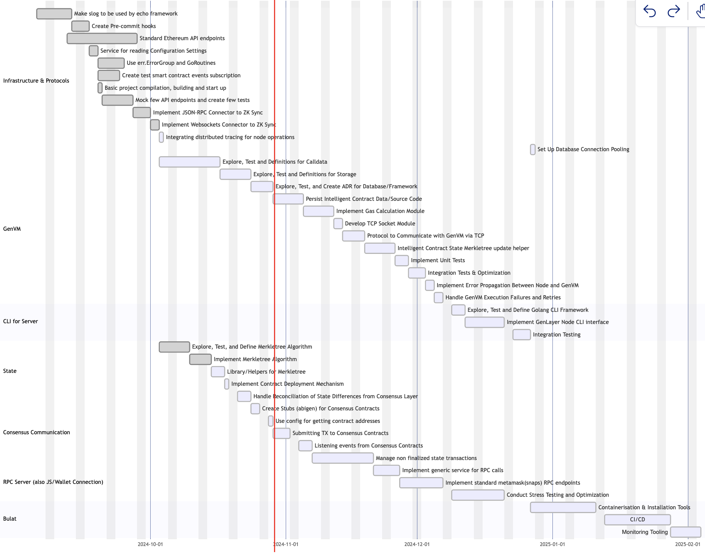

# Brief overview of the **Core Components of the GenLayer Node and The project Goals**

The chart is organized into sections that represent different components or phases, each with a list of tasks and dependencies.

## **Infrastructure & Protocols**

The **Infrastructure & Protocols** section establishes the foundational setup, connections, and essential services for the GenLayer Node, ensuring it can communicate with Ethereum, handle configuration and logging, and efficiently interact with other layers like ZK Sync for smooth, scalable operations.

**Tasks :**

- **`Make slog`** that used by echo framework is for: ensures consistent logging and monitoring across the system.
- **`Create Pre-commit hooks`**: This Helps to maintain code quality and catch issues early.
- **`Standard Ethereum API endpoints`**:  Define and implement API endpoints that adhere to Ethereum standards for interoperability this allows easy interaction with the Ethereum ecosystem and compatible tools.
- **`Service for reading Configuration Settings`**: This task contain to create and develop a configuration service to read settings from environment files or a central configuration server.
- **use `err.ErrorGroup` and `GoRoutines`:** This Task use Go errorgroup and goroutines for concurrent task handling with error propagation, for enhancing the performance by parallelizing processes and handling errors effectively.
- **`Create test smart contract events subscription:`** this mechanisms for develop a mechanism for subscribing to smart contract events and write tests to validate the functionality. Very Important Essential for event-driven operations and for testing real-time response to blockchain events.
- **`Mock few API endpoints and create few tests:`** This aims to create mock versions of key API endpoints and write initial tests to verify endpoint behavior for Enables testing the system’s integration with external services and ensures API stability.
- **`Implement JSON-RPC Connector to ZK Sync:`** This ensure to Develop a JSON-RPC connector to establish interaction with ZK Sync, Ethereum’s Layer 2 scaling solution. This connector will facilitate fast and scalable connections, enabling efficient transaction handling on ZK Sync.
- **`Implement WebSockets Connector to ZK Sync:`** This task to create a WebSocket-based connector to enable real-time communication with ZK Sync. This will allow immediate updates and provide low-latency interactions, improving responsiveness in Layer 2 network operations.
- **`Integrate Distributed Tracing for Node Operations:`** Set up distributed tracing across the node to monitor and trace requests. This will help identify and diagnose performance issues within the distributed system, ensuring smooth and optimized operations. Tools like opentelemetry or Jaeger widly used for it.

## GenVM

The **GenVM** tasks focus on creating a reliable, efficient VM that can process smart contracts, handle resources, and interact with the rest of the node. The tasks involve defining data management and communication protocols, optimizing performance, and ensuring error resilience. Each step incrementally builds a robust virtual machine that meets the demands of blockchain execution.

- **`Explore, Test, and Define Definitions for Calldata:`** This involves exploring how to handle, store, and interpret data inputs for smart contract execution, Purpose is Determine how `calldata` (data sent to smart contracts) is managed within the VM.
- **`Explore, Test, and Define Definitions for Storage:`** This ensure to define how the VM will store and retrieve data from the blockchain. Main Functionality is to establish a data storage model that persists information between contract executions. very ideal to investing of different storage architectures (e.g., key-value stores) and implement a mechanism that the VM can use to manage state changes effectively
- **`Explore, Test, and Create ADR for Database/Framework:`** Main purpose is to ensure that smart contract source code and data are stored persistently. The functionality are to store contract code and related metadata securely for retrieval during execution. for implementing this task is to develop a persistence layer using the chosen database, saving contract data with appropriate identifiers for quick access.
- **`Implement Gas Calculation Module:`** Manage the *“gas”* calculation to measure and limit computation resources used by the VM, main functionality is to calculate gas fees based on operations, ensuring the VM stays within resource constraints. This task ideal to create a module that estimates gas costs per operation, updating a counter to track the total gas used during contract execution.
- **`Develop TCP Socket Module:`** Implement a TCP server and client within the VM, handling requests and responses for data or task processing.
- **`Protocol to Communicate with GenVM via TCP:`** Define a standardized protocol for interaction between the node and GenVM, for Establish a messaging format and protocol (e.g., JSON or Protobuf) to send data or instructions to the VM.
- **`Intelligent Contract State MerkleTree Update Helper:`**  Maintain an updated Merkle tree of smart contract states for efficient verification and data integrity. By using a Merkle tree structure, updating it with every contract state change, to allow for quick proof generation and state verification.
- **`Implement Unit Tests:`** Test each VM component to validate functionality using unite testing Golang framework
- **`Implement Error Propagation Between Node and GenVM:`** Design error codes or messages, and establish error handling so that both the VM and node can act on any encountered errors.
- **`Handle GenVM Execution Failures and Retries:`** Create a retry mechanism with configurable limits to handle intermittent errors in VM processing. For Manage execution failures and automatically retry if necessary.

## CLI server

The **`CLI for Server`** Task focuses on building a command-line interface (CLI) that allows developers and operators to interact with the GenLayer Node, manage configurations, run tests, and monitor the system. This interface should provide various commands to control and observe node operations efficiently.

## State

The **`State`** Tasks focuses on managing the GenLayer Node’s data state, which is crucial for maintaining accurate and consistent data across the node and its interactions. This involves creating a robust state management system, including data structures like Merkle trees, contract deployment mechanisms, and state reconciliation processes.

- **`Explore, Test, and Define MerkleTree Algorithm:`** This ensure to study Merkle tree structures, test different approaches, and finalize the algorithm. Set up tests to verify that data in the tree can be efficiently verified. Merkle trees can help to ensure data integrity and enable quick verification of the node's data by generating cryptographic proofs.
- **`Implement MerkleTree Algorithm` :** This  Allows the node to generate proofs for stored data, enabling validation and consistency checks across the network. Implement it in Golang Code the Merkle tree, ensuring that it can add data blocks, generate proofs, and verify data integrity. Integrate this into the node’s state management system.
- **`Library/Helpers for MerkleTree`** : This Task Provides utility functions for adding, updating, and verifying data within the Merkle tree.
- **`Implement Contract Deployment Mechanism:`** This ensure to Build functions to deploy contracts, store their bytecode, and track their state. Integrate with the node’s state system so that contracts can be deployed, tracked, and executed reliably.
- **`Handle Reconciliation of State Differences from Consensus Layer` :** Identifies and resolves discrepancies between the node’s state and the consensus state to maintain accuracy.

## Consensus Communication

The **`Consensus Communication`** Tasks is focused on ensuring the GenLayer Node can effectively communicate with the consensus layer. This involves managing transaction submissions, listening to events, and ensuring that the node’s actions align with the consensus rules. These tasks establish a secure and reliable interaction between the node and the broader blockchain network, maintaining trust and consistency.

## RPC Server

The `**RPC Server**` Taks is designed to provide an interface for external applications, users, or other nodes to interact with the GenLayer Node. The RPC (Remote Procedure Call) server enables direct communication with the node, allowing access to data and services like transaction submission, state queries, and contract interactions. This section focuses on implementing the necessary RPC endpoints and ensuring that they’re efficient, secure, and aligned with standard protocols.

## Bulat (Deployment and Optimization)

The **`Bulat`** section focuses on setting up the GenLayer Node in production environments, ensuring it’s properly configured, scalable, and efficient. This involves creating tools and processes for containerization, continuous integration, monitoring, and performance optimization, which are crucial for maintaining the stability and reliability of the node in real-world conditions.